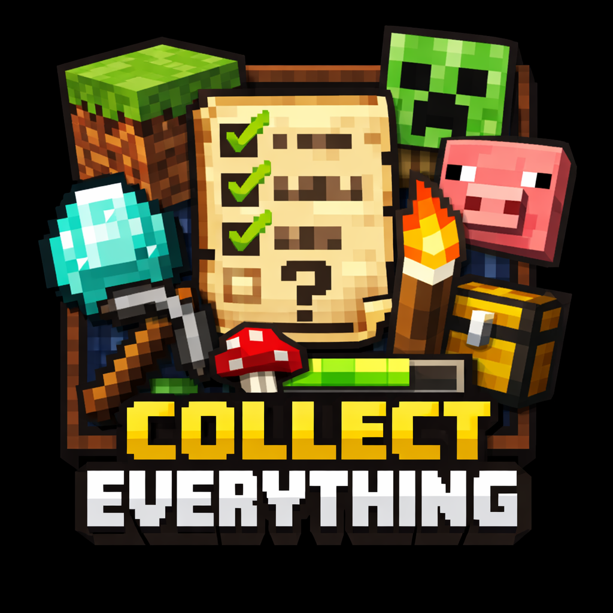

# Collect Everything! - Bedrock Add-On



[](https://github.com/sponsors/joeskeen)

A Minecraft Bedrock add-on that tracks your world exploration across multiple categories. Inspired by [Knafy's Collect Everything](https://modrinth.com/mod/collect-everything) mod for Java Edition.

## What Gets Tracked

- **Items** — picked up, crafted, or equipped into inventory
- **Special Blocks** — normally-unobtainable blocks you break (spawners, budding amethyst, chorus plant, trial_spawner, etc.)
- **Entities** — mobs you interact with (using items) or kill
- **Biomes** — detected automatically as you explore
- **Enchantments** — on items currently in your inventory
- **Effects** — potion effects currently active on you

## Commands

- `/collecteverything:stats` — view collection progress with counts/percentages
- `/collecteverything:list [type]` — list collected items by category (items, blocks, entities, biomes, enchantments, effects)
- `/collecteverything:reset` — clear all progress (admin permission)
- `/collecteverything:help` — show help

## Entity Tracking Details

- Tracks variants for horses, cats, and related mobs via the Variant component
- Villagers are tracked with their biome
- Baby mobs are tracked separately
- Warm/cold farm animal variants detected via biome tags

## Coming Soon

This is a work-in-progress project. We plan to improve the UI/UX over time, including adding forms-based browser menus and a collection book for convenient reference.

## Tech Stack

- Node.js (build tools)
- Bedrock Script API 2.7.0 (runtime logic)
- TypeScript (source)
- JSON (data/registries, forms)
- Vanilla resource/behavior packs (enumeration source)

## Developer Setup

### Prerequisites

- **MCPE Launcher must be installed via Flatpak (user-scoped)** — The build tools resolve paths to the vanilla resource packs from `~/.var/app/io.mrarm.mcpelauncher/`. If installed system-wide or via other methods, the enumerators will fall back to sample data instead of the full registry.

### 1. Link Your Test World

```bash
ln -s ~/.var/app/io.mrarm.mcpelauncher/data/mcpelauncher/games/com.mojang/minecraftWorlds/<WORLD_ID> world/development_test_world
```

### 2. Build

```bash
./build.sh
```

### 3. Test

1. Open MCPE Launcher
2. Load your test world
3. Run `/reload`

## Sponsor this add-on to include your name in an upcoming easter-egg!
